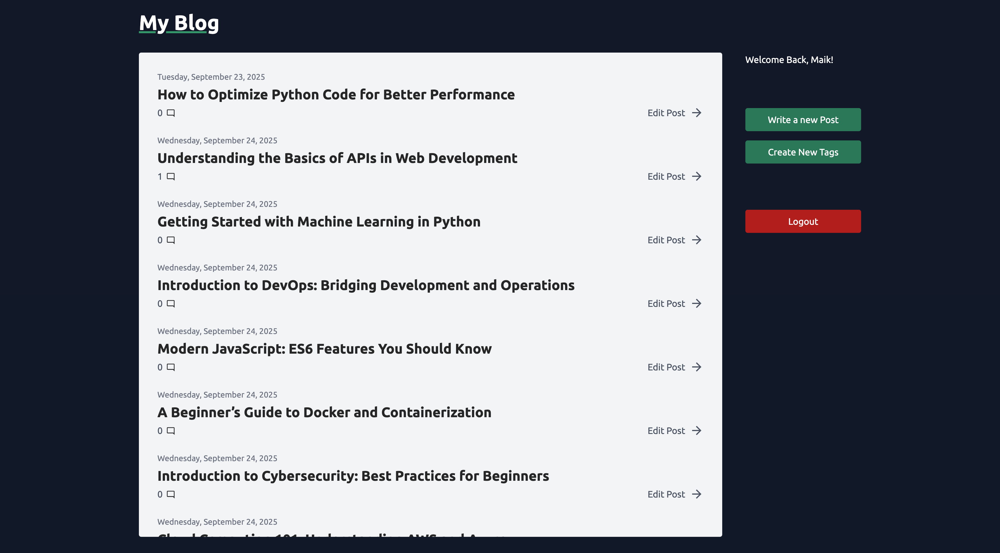
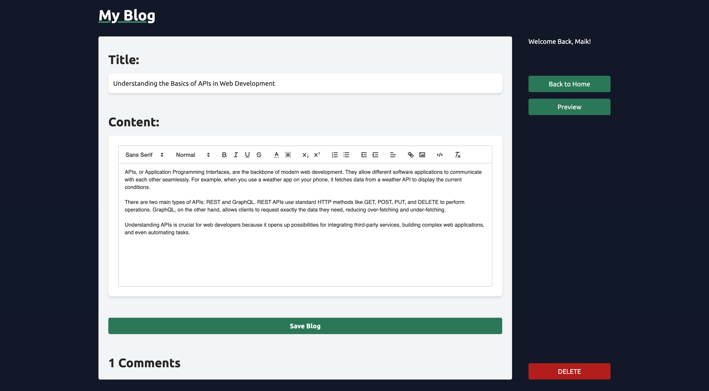
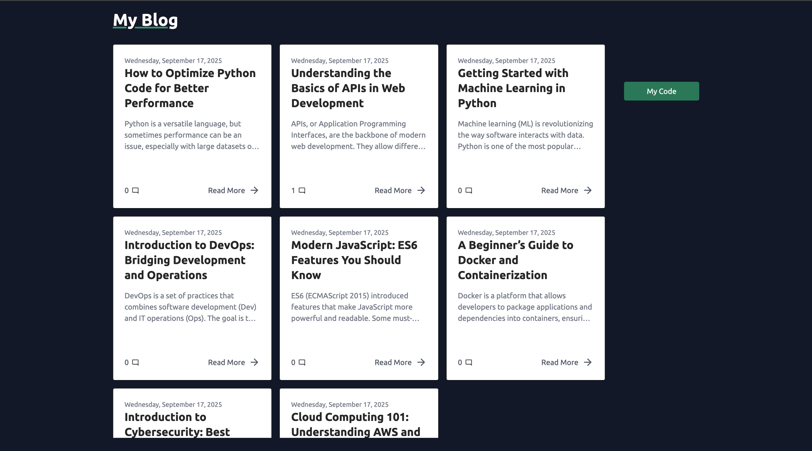
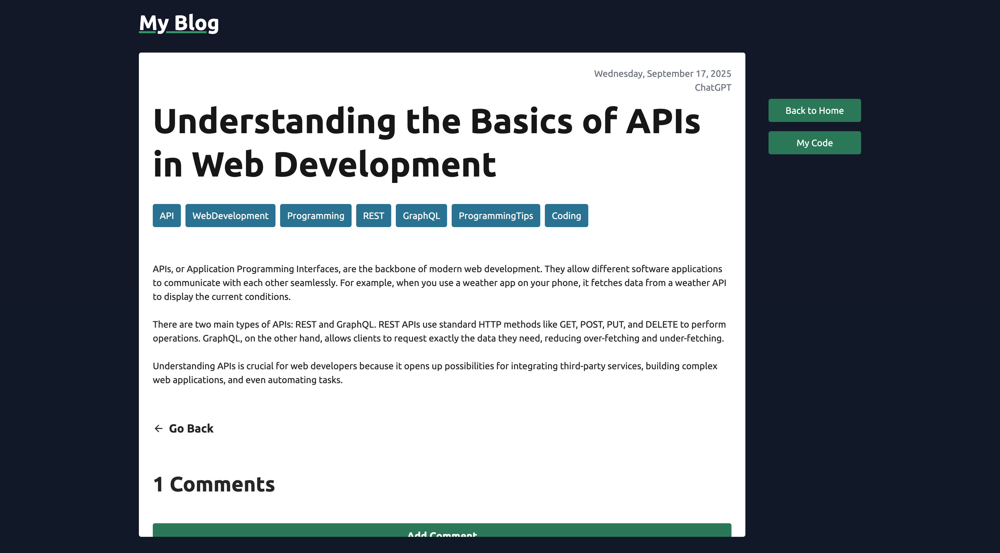

# Blog App

A full-stack blog application built with **React**, **Tailwind**, **Node.js**, **Express**, **Prisma**, and **JWT authentication**.

This project was created to practice RESTful API design, authentication, database modeling, and front-end integration.

---

## Installation

Follow these steps to run the project locally:

1.  **Clone the repository**

    ```bash
    git clone git@github.com:Maiker260/My-Blog.git
    ```

2.  **Install dependencies**

    ```bash
    cd My-Blog
    npm install
    ```

3.  **Set up PostgreSQL**

    ```
    -   Create a database (e.g., `blog_app`)
    -   Add a `.env` file with the following variables:

        PORT=""
        DATABASE_URL=""
        NODE_ENV="development"
        SESSION_SECRET=""
        ACCESS_TOKEN_SECRET=""
        REFRESH_TOKEN_SECRET=""
        FRONT_PUBLIC_URL="http://localhost:5173"
        FRONT_END_ADMIN_URL="http://localhost:5174"
    ```

4.  **Run database migrations**

    ```bash
    npx prisma migrate dev --name init
    npx prisma generate
    ```

5.  Setup environment variables for the Frontend

    ```bash
    VITE_API_URL=""
    ```

6.  **Start the backend server**

    ```bash
    npm run dev:backend
    ```

7.  **Open the frontend**

    ```bash
    npm run dev:admin
    npm run dev:public
    ```

8.  **Optional: Start all the servers at the same time**

    ```bash
    npm run dev
    ```

---

## Features

   **User Authentication**

-   Sign up and login
-   Passwords hashed with **bcrypt**
-   JWT-based session management
-   Admin and author roles for route protection

   **Posts**

-   Create, edit, delete posts (protected routes)
-   Publish/unpublish posts
-   Fetch and display posts to users
-   Timestamp and author linked to each post

   **Comments**

-   Add, edit, delete comments
-   Admins can manage all comments

   **Frontend**

-   List of all posts
-   Author/admin panel for managing posts and comments
-   Protected routes for sensitive actions

---

## API

   **Main**

    ` /api`

   **Auth**

-   `POST /auth/signup`
-   `POST /auth/login`
-   `POST /auth/logout`
-   `POST /auth/refresh`
-   `GET /auth/me` (protected)

   **Users**

    `/userId`

-   `GET /posts` (protected)
-   `GET /posts/:id` (protected)
-   `POST /new` (protected)
-   `PUT /posts/:id` (protected)
-   `DELETE /posts/:id` (protected)

-   `GET /tags/` (protected)
-   `PUT /tags/` (protected)

   **Posts**

-   `GET /posts`
-   `GET /posts/:id`

   **Tags**

-   `GET /tags`

---

## Demo

Backend - API:
https://my-blog-uyjt.onrender.com

Frontend-Public:
https://my-blog-805.pages.dev/

Frontend-Admin:
https://my-blog-admin-9l6.pages.dev/

---

## Screenshots

Admin Home Page


Admin Editor Page


Public Main Page


Public Article Page


---

## Acknowledgements

-   [React](https://react.dev/)
-   [React Router](https://reactrouter.com/)
-   [Tailwind](https://tailwindcss.com/)
-   [Node.js](https://nodejs.org/)
-   [Express](https://expressjs.com/)
-   [Prisma](https://www.prisma.io/)
-   [JWT](https://jwt.io/)
-   [Passport.js](http://www.passportjs.org/)
-   MDN Web Docs for API and security guidance

---

## Author

-   [@Maiker260](https://github.com/Maiker260)
